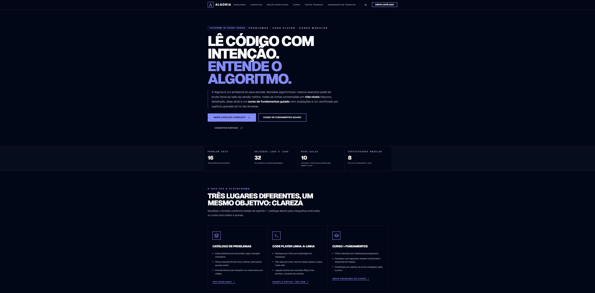
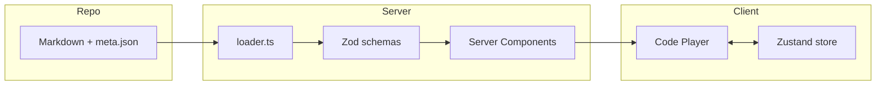

# Algoria

Plataforma em português para estudar **algoritmos e decisões em código** através de leitura guiada: catálogo de problemas com várias soluções (brute-force, óptima, alternativa), **code player** linha-a-linha com três níveis de explicação, mini-guias em **Conceitos**, **curso modular** com avaliações locais, hub de **inglês técnico para entrevistas** (conteúdo em inglês) e guias de **engenharia aplicada** (front, back, DevOps).

<h1 align="center">
  <br/>
  <strong>Algoria</strong>
  <br/><br/>
  <sub>Lê código com intenção · Entende o algoritmo</sub>
  <br/><br/>
  
</h1>

## Funcionalidades

- 📚 **Catálogo de problemas** — enunciados em Markdown, tags, dificuldade e várias implementações lado a lado quando existirem
- 🎯 **Code player** — navegação linha-a-linha, destaque sintaxe (Shiki), painel com níveis Resumo / Detalhado / Deep dive e atalhos de teclado
- 🧠 **Conceitos** — páginas longas (fundamentos, estruturas, padrões) carregadas do repositório em Markdown
- 🎓 **Curso guiado** — trilha modular com exemplos, MCQs e certificado por capítulo (progresso no browser)
- 🌍 **Interview English** — hub `/interview-en` com vocabulário e scripts 100% em inglês para entrevistas
- 💼 **Engenharia no trabalho** — guias didáticos `/engineering-work` (frontend, backend, DevOps)
- 🌓 **Tema claro/escuro** (`next-themes`)
- 📊 **Analytics opcional** — PostHog quando `NEXT_PUBLIC_POSTHOG_KEY` está definido
- 🔍 **SEO** — `sitemap.ts` e `robots.ts` com gate por ambiente (`NEXT_PUBLIC_ENVIRONMENT` + `NODE_ENV`)
- ✅ **Validação de conteúdo** — script Zod para problemas, conceitos, hubs `interview-en` e `engenharia-trabalho`

## Estrutura do Projeto

```txt
algoria/
├── app/                              # Next.js App Router
│   ├── page.tsx                      # Landing
│   ├── layout.tsx                    # Layout global + providers
│   ├── globals.css
│   ├── robots.ts                     # robots.txt (indexação condicional)
│   ├── sitemap.ts                    # Sitemap (produção)
│   ├── problems/                     # Catálogo, problema, player por solução
│   ├── concepts/                     # Índice + página por conceito
│   ├── curso/                        # Programas e módulos guiados
│   ├── interview-en/                 # Hub EN + artigos
│   └── engenharia-trabalho/          # Hub + guias por slug
├── components/
│   ├── ui/                           # Button, Card, Tabs, Badge, …
│   ├── layout/                       # Site header / footer
│   ├── branding/                     # Logo
│   ├── catalog/                    # Catálogo de problemas (client)
│   ├── code-player/                # Player, vista de código, store Zustand
│   ├── problem/                    # Tabs / barras de estudo
│   ├── solution/                   # Seletor de linguagem, trackers
│   ├── course/                     # Runner do curso, MCQ, certificado
│   ├── concepts/                   # Tracker de visitas
│   ├── complexity/                 # Badges Big O
│   ├── analytics/                  # PostHog provider
│   └── theme-*.tsx
├── content/                          # Fonte editorial (Markdown + JSON)
│   ├── problems/<slug>/             # meta, description, solutions/…
│   ├── concepts/<slug>/             # meta.json, body.md
│   ├── interview-en/<slug>/
│   └── engenharia-trabalho/<slug>/
├── lib/
│   ├── content/                     # loader.ts, schemas.ts (Zod), markdown, shiki
│   ├── catalog/                     # Filtros e modelos de cards
│   ├── courses/                     # Seed do curso, hidratação
│   ├── progress/                    # Progresso local (schema + helpers)
│   ├── stores/                      # Zustand (ex.: progresso do curso)
│   └── utils.ts
├── scripts/                         # validate-content, sync annotations, bootstrap
├── public/
├── AGENTS.md                        # Regras para agentes / Next.js
├── LEETCODE_LEARNING_APP_PLAN.md    # Plano editorial / roadmap amplo
└── package.json
```

## Arquitetura e Design

### Visão Geral

O Algoria trata **conteúdo como dados versionáveis**: pastas em `content/` definem problemas, conceitos e guias; o servidor lê o disco em build/request conforme a rota, valida com **Zod** e gera HTML (Markdown via `marked`). O **code player** é uma ilha interativa no cliente com estado local (**Zustand**) sincronizado com as anotações por linha.

### Fluxo de conteúdo → página



### Decisões de Design

1. **Conteúdo em repositório** — sem CMS obrigatório; PRs revisam texto e JSON; `pnpm validate:content` falha em meta inválido ou anotações inconsistentes com o código.
2. **Leitura primeiro** — múltiplas soluções por problema para contrastar complexidade e decisões de implementação.
3. **Anotações em três níveis** — granularidade progressiva por linha (`annotations.json`), reutilizável pelo player e pelo curso.
4. **TypeScript estrito + Zod** — contratos explícitos para metadados de problemas, soluções, conceitos e hubs editoriais.
5. **UI enxuta** — Tailwind v4, componentes estilo shadcn (Radix), tipografia para artigos (`@tailwindcss/typography`).
6. **Privacidade por defeito** — PostHog só inicializa com chave pública; tema e progresso do curso privilegiam armazenamento local onde aplicável.

## Tecnologias Utilizadas

<div align="center">
  
  
  
  
  
  
  
  
  
  
  
</div>

> Stack principal: Next.js (App Router), React 19, TypeScript, Tailwind CSS v4, Zod, Radix, Shiki, marked, Zustand; analytics opcional via PostHog.

## Atalhos do code player

| Tecla           | Ação                                                |
| --------------- | --------------------------------------------------- |
| `←` / `→`       | Linha anterior / seguinte                           |
| `Espaço`        | Play / pausa (autoplay)                             |
| `1` / `2` / `3` | Nível de explicação: Resumo / Detalhado / Deep dive |

## Adicionar um novo problema (resumo)

1. Cria `content/problems/<slug>/meta.json` conforme `ProblemMeta` em `lib/content/schemas.ts`.
2. Adiciona `description.md`.
3. Para cada solução: `content/problems/<slug>/solutions/<solution-slug>/` com `meta.json`, código (`solution.ts`, …), `intro.md`, `annotations.json`.
4. Opcional: `prerequisites` com slugs de `content/concepts/`.
5. Corre `pnpm validate:content` antes de commit.

## Desenvolvedor

| Foto                                                                                                                                    | Nome                                                 | Cargo                                         |
| --------------------------------------------------------------------------------------------------------------------------------------- | ---------------------------------------------------- | --------------------------------------------- |
|  | [Jonatas Silva](https://github.com/JsCodeDevlopment) | Fullstack Software Engineer / Product Manager |

---

<div align="center">
  <sub>Built with care by <a href="https://github.com/JsCodeDevlopment">Jonatas Silva</a></sub>
</div>
