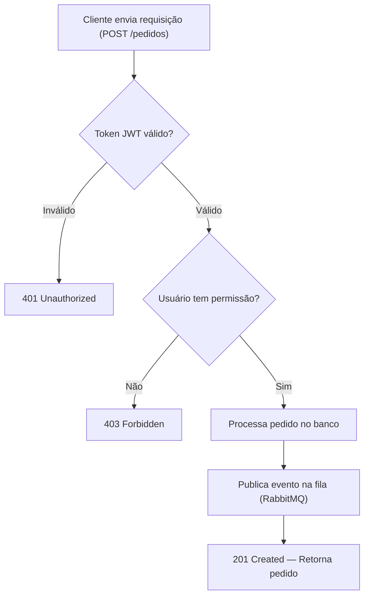
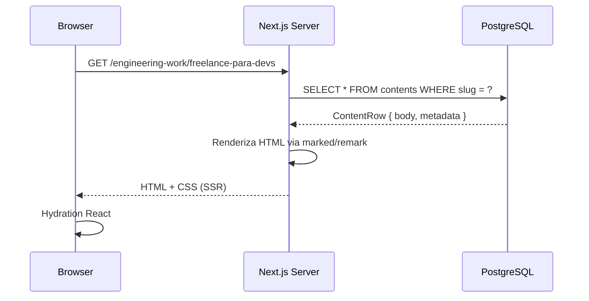
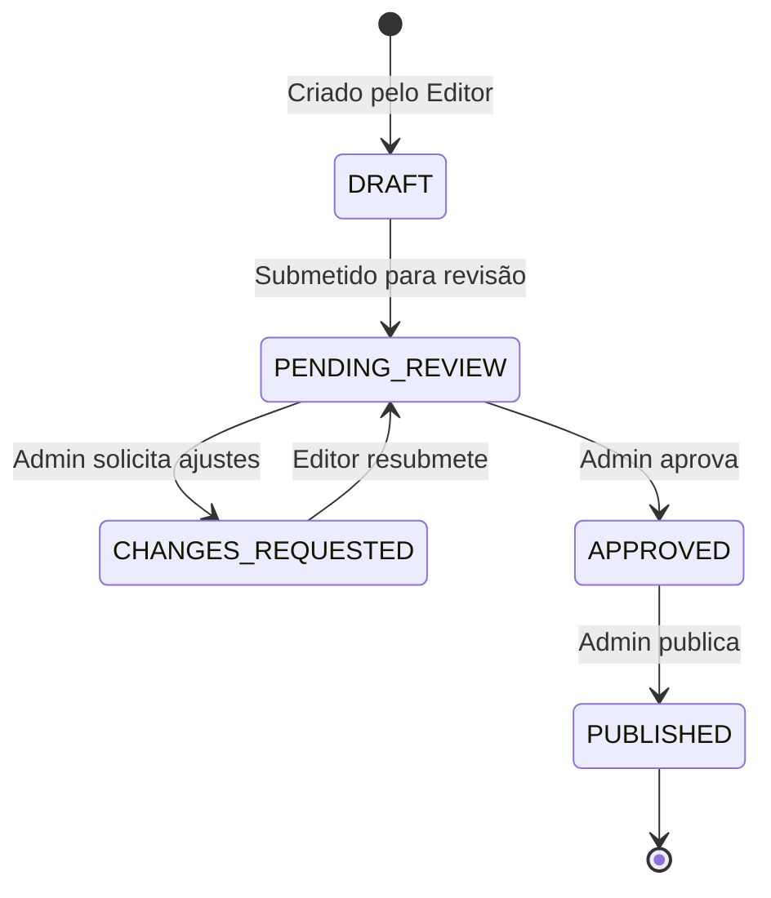

# Guia de Referência de Formatação — Acite Creator Kit

Este é o **arquivo de referência completo** de todos os recursos de formatação disponíveis para criadores de conteúdo na plataforma Acite.  
Use-o como modelo ou consulta rápida ao escrever seus artigos.

---

## Objetivos de aprendizagem

1. Dominar a formatação padrão de Markdown suportada pela plataforma.
2. Usar os componentes didáticos customizados (`:::didactic-figure`, `:::didactic-metrics`, `:::didactic-bar-chart`).
3. Criar diagramas e fluxos com Mermaid embutido.
4. Estruturar o conteúdo de forma que seja visualmente rico e fácil de escanear.

---

## 1. Formatação Padrão de Markdown

Você pode usar toda a formatação padrão do CommonMark/GitHub Flavored Markdown.

### 1.1 Ênfase e Tipografia

- **Negrito** → `**texto**`
- *Itálico* → `*texto*`
- ~~Tachado~~ → `~~texto~~`
- `Código em linha` → `` `código` ``
- [Link externo](https://acite.dev) → `[texto](url)`
- > Citação em bloco → `> texto`

### 1.2 Listas

**Lista não-ordenada:**
- Item principal
  - Sub-item
    - Sub-sub-item

**Lista ordenada:**
1. Primeiro passo
2. Segundo passo
   1. Sub-passo A
   2. Sub-passo B
3. Terceiro passo

**Lista de tarefas:**
- [x] Tarefa concluída
- [ ] Tarefa pendente
- [ ] Outra tarefa

### 1.3 Tabelas Comparativas

Tabelas são ideais para comparar tecnologias, estratégias ou valores. Use alinhamento de coluna para organizar visualmente.

| Funcionalidade | CSR (Client-Side) | SSR (Server-Side) | SSG (Static) |
| :--- | :---: | :---: | :---: |
| **SEO nativo** | ❌ Difícil | ✅ Excelente | ✅ Excelente |
| **Velocidade (TTFB)** | 🟡 Lento | 🟢 Rápido | 🟢 Muito Rápido |
| **Dados em tempo real** | ✅ Sim | ✅ Sim | ❌ Não |
| **Custo de servidor** | 🟢 Baixo | 🔴 Alto | 🟢 Baixo |
| **Complexidade** | Média | Alta | Baixa |

---

## 2. Alertas e Caixas de Destaque

Use alertas para enfatizar informações específicas. Não use mais de um alerta seguido do mesmo tipo.

> [!NOTE]
> **Nota informativa:** Use para observações gerais, contexto adicional ou informações de background que enriquecem o entendimento do leitor.

> [!TIP]
> **Dica de performance:** Use para compartilhar atalhos, boas práticas, otimizações e sugestões de produtividade.

> [!IMPORTANT]
> **Informação crítica:** Use para destacar requisitos obrigatórios, passos que não podem ser pulados ou configurações essenciais.

> [!WARNING]
> **Atenção ao risco:** Use para alertar sobre erros comuns, bugs conhecidos, ou comportamentos que podem causar problemas em produção.

> [!CAUTION]
> **Perigo real:** Use apenas para ações irreversíveis, como exclusão de dados ou operações que afetam produção diretamente.

---

## 3. Componentes Didáticos Customizados

A plataforma Acite suporta componentes interativos embutidos no Markdown usando a sintaxe `:::tipo { ... } :::`.

### 3.1 Figuras com Legenda (`:::didactic-figure`)

Use para inserir imagens hospedadas na pasta `/public/engenharia/` com legenda e texto alternativo de acessibilidade.

**Sintaxe:**
```
:::didactic-figure
{
  "src": "/engenharia/nome-da-imagem.png",
  "alt": "Descrição da imagem para leitores de tela",
  "caption": "Legenda exibida abaixo da imagem, explicando o contexto."
}
:::
```

**Exemplo real:**
:::didactic-figure
{
  "src": "/engenharia/freelance-jornada.png",
  "alt": "Jornada do freelancer: prospecção, fechamento, entrega, pós-venda e crescimento",
  "caption": "Freelance é um negócio completo, não apenas execução técnica. Cada fase exige habilidades distintas."
}
:::

---

### 3.2 Cards de Métricas (`:::didactic-metrics`)

Use para exibir comparativos numéricos, KPIs ou dados estatísticos de forma visual, em grade de cards.

**Sintaxe:**
```
:::didactic-metrics
{
  "title": "Título da seção de métricas",
  "columns": 3,
  "items": [
    { "label": "Nome da Métrica", "value": "Valor", "sublabel": "Descrição complementar" }
  ]
}
:::
```

**Exemplo — Core Web Vitals:**
:::didactic-metrics
{
  "title": "Thresholds de Performance (Core Web Vitals 2026)",
  "columns": 3,
  "items": [
    { "label": "LCP (Largest Contentful Paint)", "value": "< 2.5s", "sublabel": "Carregamento principal OK" },
    { "label": "INP (Interaction to Next Paint)", "value": "< 200ms", "sublabel": "Responsividade OK" },
    { "label": "CLS (Cumulative Layout Shift)", "value": "< 0.1", "sublabel": "Estabilidade visual OK" }
  ]
}
:::

---

### 3.3 Gráficos de Barras (`:::didactic-bar-chart`)

Use para comparar valores numéricos de forma visual: alíquotas, tempos de carregamento, pontuações, etc.

**Sintaxe:**
```
:::didactic-bar-chart
{
  "title": "Título do gráfico",
  "unit": "Unidade do valor (ex: %, ms, req/s)",
  "caption": "Legenda explicando o contexto do gráfico.",
  "bars": [
    { "label": "Rótulo da barra", "value": 42 }
  ]
}
:::
```

**Exemplo — Comparativo de alíquotas:**
:::didactic-bar-chart
{
  "title": "Alíquota de Imposto por Regime Tributário (Faturamento R$ 15k/mês)",
  "unit": "% de imposto",
  "caption": "Simples Nacional no Anexo III com Fator R ativo é o regime mais vantajoso para a maioria dos desenvolvedores autônomos.",
  "bars": [
    { "label": "ME — Simples Anexo III (com Fator R)", "value": 6.0 },
    { "label": "ME — Simples Anexo V (sem Fator R)", "value": 15.5 },
    { "label": "Lucro Presumido", "value": 11.3 },
    { "label": "Pessoa Física (Carnê-leão)", "value": 27.5 }
  ]
}
:::

---

## 4. Diagramas e Fluxos (Mermaid)

Diagramas Mermaid são renderizados dinamicamente na plataforma. Use para fluxogramas, sequências, arquiteturas e ciclos de vida.

### 4.1 Fluxograma (graph TD / LR)



### 4.2 Diagrama de Sequência



### 4.3 Diagrama de Estados



---

## 5. Blocos de Código com Sintaxe Colorida

Use a linguagem correta para obter destaque de sintaxe (powered by Shiki).

**TypeScript:**
```typescript
async function getEngineeringWorkGuide(slug: string): Promise<EngineeringWorkGuide | null> {
  const result = await db
    .select()
    .from(contents)
    .where(and(
      eq(contents.slug, slug),
      eq(contents.type, 'engineering-work'),
      eq(contents.status, 'PUBLISHED'),
    ))
    .limit(1);

  if (!result[0]) return null;
  return parseEngineeringGuide(result[0]);
}
```

**SQL:**
```sql
SELECT
  c.id,
  c.slug,
  c.title,
  c.body,
  u.name AS author_name
FROM contents c
LEFT JOIN "user" u ON c."authorId" = u.id
WHERE c.type = 'engineering-work'
  AND c.status = 'PUBLISHED'
ORDER BY c."publishedAt" DESC
LIMIT 10;
```

**Bash:**
```bash
# Instalar dependências e rodar servidor local
pnpm install
pnpm dev

# Rodar o script de compilação de conteúdo
node public/creator-support/compilar-json.js
```

**JSON:**
```json
{
  "title": "Meu Artigo Exemplo",
  "slug": "meu-artigo-exemplo",
  "type": "engineering-work",
  "publish": false,
  "meta": {
    "pillar": "backend",
    "access": "free",
    "summary": "Um guia completo sobre como estruturar APIs REST robustas.",
    "estimatedMinutes": 20
  }
}
```

---

## 6. Separadores e Estrutura de Seções

Use `---` para separar visualmente seções longas. Sempre use hierarquia de headings correta:

- `#` — Título do artigo (apenas um por arquivo)
- `##` — Seções principais (ex: `## 1. Introdução`)
- `###` — Subseções (ex: `### 1.1 Contexto`)
- `####` — Sub-subseções (ex: `#### 1.1.1 Detalhe específico`)

---

## 7. Citações e Destaques Textuais

Use blockquotes para destacar frases-chave, definições ou citações importantes:

> **Definição:** API REST (Representational State Transfer) é um estilo arquitetural para sistemas distribuídos baseado em recursos identificados por URLs e manipulados via verbos HTTP padronizados.

> **Regra prática:** Nunca exponha stack traces completos em respostas de erro de APIs em produção. Retorne mensagens genéricas para o cliente e registre o erro completo apenas nos logs internos.

---

## 8. Recursos de Imagem — Guia de Caminhos

Todas as imagens devem estar na pasta `public/engenharia/` do projeto.

| Tipo de Imagem | Caminho para usar no `src` |
| :--- | :--- |
| PNG gerado pelo script | `/engenharia/minha-imagem.png` |
| SVG de diagrama | `/engenharia/minha-imagem.svg` |
| Capa do artigo | `/engenharia/cover-meu-artigo.png` |

> [!IMPORTANT]
> Sempre forneça um `alt` descritivo e uma `caption` contextual. Isso melhora a acessibilidade e o SEO do artigo na plataforma.
